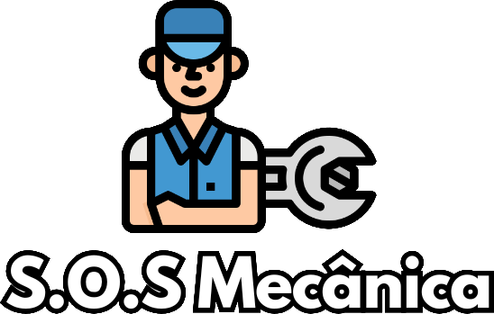

O **Sistema de Acompanhamento para Oficina Mecânica** foi desenvolvido para otimizar a comunicação entre a oficina e seus clientes. Ele permite acompanhar em tempo real o progresso da manutenção dos veículos, proporcionando maior transparência, agilidade e qualidade no atendimento.

## Funcionalidades

- **Cadastro de Clientes:** Permite o registro de informações como nome, contato e endereço.
- **Cadastro de Veículos:** Associa veículos a clientes, com informações como placa e chassi.
- **Registro de Diagnósticos e Status:** Mecânicos podem registrar diagnósticos e atualizar o status da manutenção.
- **Notificações Automáticas:** Notifica os clientes sobre mudanças no status de manutenção via e-mail ou SMS.
- **Histórico de Serviços:** Os clientes podem consultar o histórico de manutenções realizadas.

## Tecnologias Utilizadas

- **Back-end:** [Laravel](https://laravel.com) (PHP)
- **Front-end:** [React.js](https://reactjs.org)
- **Prototipação:** [Figma](https://www.figma.com)
- **Ambiente de Desenvolvimento:** Visual Studio Code
- **Controle de Versão:** Git e GitHub

## Requisitos Funcionais

1. Cadastro de clientes com dados essenciais.
2. Cadastro de veículos associados aos clientes.
3. Registro de diagnósticos e status da manutenção.
4. Consulta de status de manutenção pelos clientes.
5. Envio de notificações sobre mudanças de status.

## Requisitos Não Funcionais

- Segurança dos dados pessoais.
- Interface intuitiva e responsiva.
- Facilidade de manutenção e escalabilidade.
- Suporte a acessos simultâneos.

## Estrutura do Sistema

### Diagrama de Casos de Uso
Inclui funcionalidades como cadastro de clientes, veículos, diagnósticos e envio de notificações.

### Diagrama de Classe
Descreve a relação entre clientes, veículos e manutenções.

### Descrição das Telas

#### Tela de Cadastro de Clientes
- Nome, telefone, e-mail e endereço.
- Botão para confirmar o cadastro.

#### Tela de Cadastro de Veículos
- Placa, chassi e vínculo com cliente.
- Botão para confirmar o cadastro.

#### Tela de Registro de Diagnósticos
- Exibe histórico e permite atualizar o status.

#### Tela de Listagem e Gerenciamento
- Listas de clientes, veículos, peças e colaboradores.
- Opções de edição e remoção.

#### Tela Inicial (Landing Page)
- Apresentação dos serviços.
- Mapa com localização da oficina.
- Links para orçamento e cadastro.

## Pré-requisitos para Rodar o Projeto

- XAMPP -   **v3.3.0 (Para conexão com banco de dados Se for Windows)**
- COMPOSER -    **Version 2.6.5 2023-10-06 10:11:52**
- LARAVEL - **Laravel Framework 10.48.17**
- NODE.JS - **v20.10.0**

# Passo a passo:

## Configuração do Ambiente

1. **Crie uma cópia para você:** Faça um fork deste repositório

2. **Baixe o projeto:** Clone o repositório forkado no seu computador:
   ```bash
   git clone https://github.com/seu-usuario/nome-do-repositório.git
   cd nome-do-repositório
   ```
3. **Instale as dependências:** Acesse com o terminal pasta do projeto e aplique os seguintes comandos:
   ```bash
   composer install
   npm install
   ```

4. **OBS:** No caso da mensagem: (4 vulnerabilities (2 moderate, 2 high) aparecer, aplique esse comando na pasta do projeto:
    ```bash
    npm audit fix
    ```

5. **Configure o ambiente:** Crie uma cópia do arquivo ```.env.example```, renomeie-a para ```.env``` e configure as variáveis de ambiente, incluindo as chaves de API.

6. **Execute as migrações do banco de dados:**
   ```bash
   php artisan migrate --seed
   ```

7. **Crie as chaves de criptografia da aplicação:**
   ```bash
   php artisan key:generate
   ```
8. **Execute o projeto:** Abra 2 terminais na pasta do projeto e aplique um dos comandos abaixo em cada terminal:
    ```bash
    php artisan serve
    npm run dev
    ```